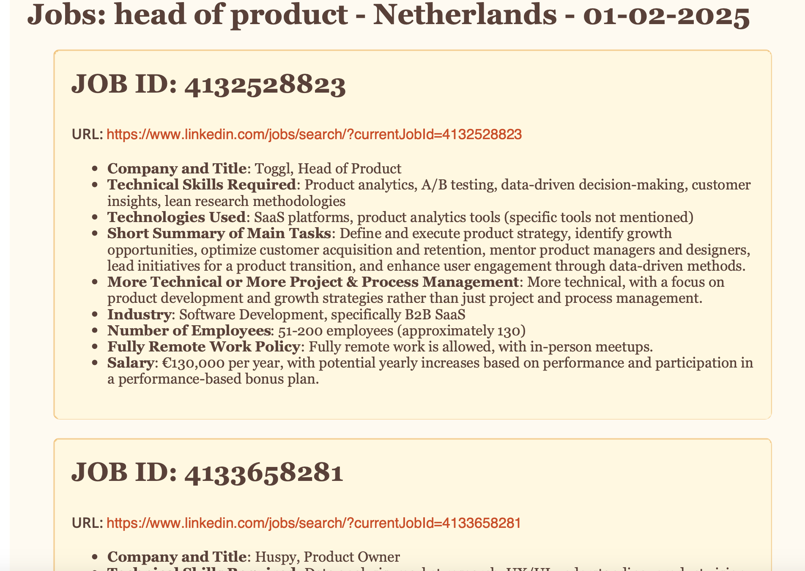

# Automate finding jobs that fit with llm

  

An automated tool that scrapes LinkedIn job postings and use LLM prompting to extract from jobs what you are looking for and avoid having to dig through all the HR cliches

## To do
change into proper project structure
add tests  
add UI to run script from

## commit changes
to commit, merge and push changes from dev run `./git-update-main.sh`

## Features

1. Open chrome, navigate to linkedin  
2. search for specfied job title, location and filters
3. use LLM prompt to extract specific data from each job
4. add results for all jobs to PDF and save
5. uss LLM to find best and worst jobs from search results

## Project Structure

  

## Prerequisites

  

- Python 3.8+

- Chrome browser

- wkhtmltopdf (for PDF generation)

  

## Installation

  

1. Clone the repository:

  

3. Install wkhtmltopdf:

- Windows: Download from [wkhtmltopdf downloads](https://wkhtmltopdf.org/downloads.html)

- Mac: `brew install wkhtmltopdf`

- Linux: `sudo apt-get install wkhtmltopdf`

  

4. Create a `.env` file with your credentials:

  

## Usage

  

### Command-line Scraper

  

Run the LinkedIn scraper:

  

The scraper will:

1. Log into LinkedIn (requires manual CAPTCHA verification)

2. Search for specified job titles

3. Filter for remote positions and experience levels

4. Generate a PDF report in the `results` folder

  

### Web Interface to test llm prompt

  

Start the web interface:

  

Access the web interface at `http://localhost:5000` to:

- Input job descriptions manually

- Configure analysis prompts

- Get instant AI analysis

  

## Configuration

  

- Modify `config/system_prompt.py` to customize the AI analysis

- Adjust search parameters in `src/scraper/linkedin_scraper.py`:

- `search_keys`: Job title to search for

- `location`: Geographic location filter
- `max results`: limit results for report

- Number of jobs to analyze